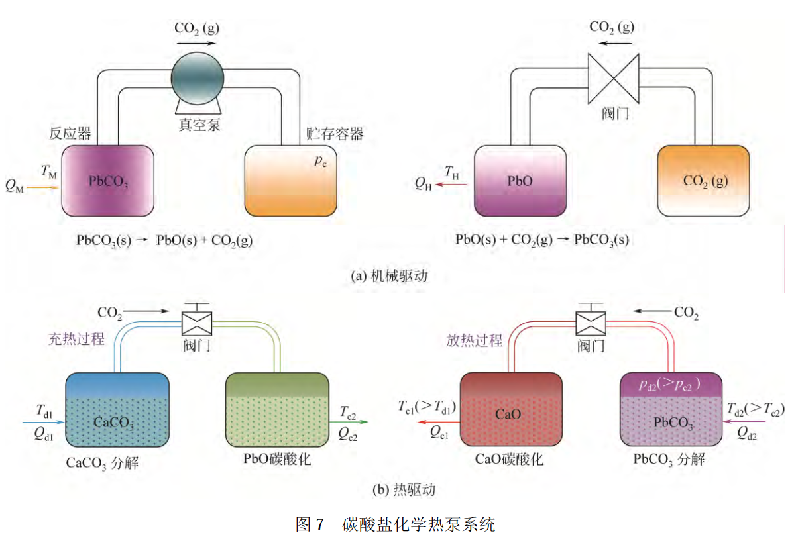
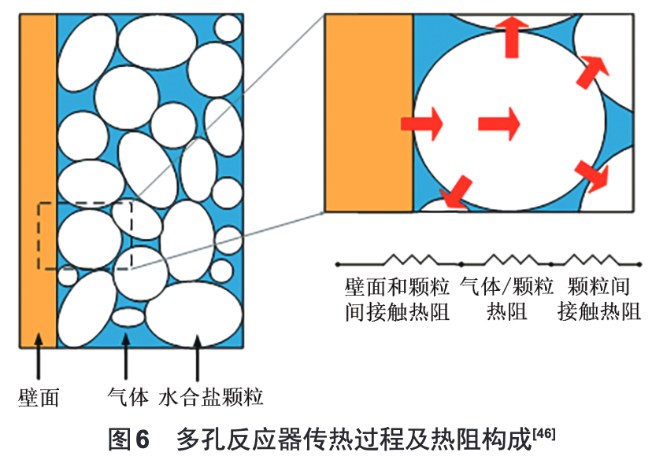

# 化学蓄热

## 储热技术

### 材料

#### 配方

##### 显热

- 80s 导热油
- 多元混合熔盐$(\mathrm{NaNO_3-KNO_3-Ca(NO_3)_2})$

##### 相变

- 水合盐-中低温储能，过冷和相分离问题
- 金属合金-中高温储能，价格昂贵
- 熔融盐-价格低、储能密度高、温度范围广
- 有机（石蜡、脂肪酸、多元醇、聚烯烃、聚多元醇）-无相分离、过冷，腐蚀性小，除热密度小，导热率低，易燃烧
- 增稠型-水合盐、低温有机材料
  增稠剂-缔合型：疏水官能团与氢键/非缔合型：大分子物理缠结
- 胶囊（聚苯乙烯+石蜡）（陶瓷+金属）制备复杂
- 定型-带骨架，防腐蚀

##### 热化学

#### 分子动力学模拟研究

- 石墨烯增强传热能力，但 EVA 与石墨烯之间的复杂相互作用可能影响相变材料中原子的振动->当石墨烯的质量分数大于 0.7%后，体系的热导率会出现下降趋势
- 在熔融盐中添加纳米颗粒的比热增强效果
- $Ca(OH)_2$ 分子具有更大的空间置换性，因此相比 CaO 分子更容易发生团聚现象
- 掺杂 $SiO_2$ 颗粒可以防止团聚过程的发生

#### 储热材料制备技术

- 微胶囊包裹法、浸渍吸附法、直接混合烧结/浇铸法、挤出成型法
- 

#### 腐蚀问题

- 低温储热中，水合盐类相变材料具有较强的腐蚀性
- 不锈钢 316 几乎对所有水合盐具有比较好的耐腐蚀性
- 高温熔融盐的腐蚀性一般比低温水合盐的腐蚀问题要显著得多
- 金属相变材料在高温下相变为液态金属后都具有比较活泼的化学性质（形成合金）
- 腐蚀试验，不锈钢 304L 和 316 具有更佳的经济性
- 氯化盐的使用温度比硝酸盐的更高，其腐蚀性也更强
- 防腐：阳极牺牲，腐蚀延缓剂，防腐涂料，烘干熔融盐、抛光金属

### 装置

#### 相变过程

- 相界面移动、潜热释放、非线形
- 空穴形状、发展、位置
- 固、液相热传导
- 液态想变材料的流动、对流换热
- 辐射

#### 数值解法

##### 等效比热容

- 把物质的相变潜热看作是在一个很小温度范围内有一个很大的显比热容->把分区描述的相变问题转变为单一区域上的非线性导热问题
- 假设：常物性、忽略自然对流、各向同性、无产热
- 不适用于窄相变温度

##### 焓法

- 将热焓和温度一起作为待求函数，在整个区域建立一个统一的能量方程，利用数值方法求出焓分布，然后确定两相界面
- 不需要跟踪界面，将固液分开处理->更适合多维的情况

#### 性能优化

##### 板式

- 传热系数高、结构紧凑、热损失小
- 密封性差、不易清洗

##### 管壳式

- 添加翅片和内管偏心设置

##### 填充式

- 结构简单、换热面积大、换热效率高
- 多层型填充床床中的相变材料比单类型系统融化得早得多，出水温度也高于单型填充床
- 沿流动方向减小球径的双层填充床->温度均匀性、换热效果提高

### 系统

#### 相变储热

- 基于相变储热的**数据中心**热管理系统
- 冷链**移动冷库**（火车、汽车货柜、冰箱）

#### 热化学

- **季节性**热化学存储系统
- $\mathrm{BaCl_2/NH_3}$太阳能空调

#### 液态空气储能

- 没有储热和储冷装置，效率 27%
- 有冷/热循环，效率>50%
- 丙烷（-185°C）甲醇（-75˚C）

### 政策

## 化学储热技术

### 浓度差热储存*（物理吸收）*
- 利用酸碱盐溶液在浓度发生变化时吸收/放出热量的原理来储存/释放热能
- 用平板太阳能集热器驱动（70˚C）

### 化学吸附

### 化学吸附

### 化学反应
- 甲烷重整
  - 用于储存太阳能、核能以及工业的高温废热
  - 1970s
- 氨分解/合成
  - 可逆性好、无副反应、反应物为流体便于输送
  - 合成氨工业已经相当完善
  - 太阳能中高温热利用
- 异丙醇分解/合成
- 金属氢化物
- 碳酸盐
  - 利用CO2储热
    - 将CO2压缩进行储存
    - 采用另一种金属氧化物，使其与产生的CO2进行碳酸化（比较有优势）
    - 采用合适的吸附剂，对CO2进行吸附储存
  - CaCO3化学热泵
    - 
- 金属氧化物
  - Fe/Co/Mn氧化物
  - 反应温度太高
  - 储能密度大
- 氢氧化物
  - Mg(OH)2复合材料
    - CaCl2提高吸水性
    - 膨胀石墨EG
    - LiBr使Mg(OH)2分布更均匀，结合更好
    - 膨胀蛭石
    - 沉淀法加Ni

## 化学蓄热材料

### 概述

- 能量储存密度有数量级的提升
- 化学反应过程没有材料物理相变存在的问题
- 体系通过催化剂或产物分离方法极易用于长期能量储存
- 安全系数低
- 化学蓄热材料在反应器中的传质传热效率需要进一步提高

### 金属氢氧化物

#### $Ca(OH)_2$

- 非常适用于大规模的太阳能储存装置
- 在反应稳定性以及蓄热性能方面表现比较突出
- 通过优化反应器改善原本较低的水渗透率
- 颗粒团聚问题

#### $Mg(OH)_2$

- 反应稳定性上的表现远不如$Ca(OH)_2$

##### 添加 LiCl

- 水解反应分为两步->构建了 Mg(OH)2 摩尔含量与两步反应速率之间的关系->没有提及水合反应的关键控制步骤

##### Mg(OH)2/膨胀石墨/LiBr

- LiBr 催化剂
- 碳载体的作用在于提高传热效率以及反应稳定性

### 金属氢化物($MgH_2、CaH_2$)

- 储能密度高
- 清洁无污染
- 循环稳定性好

#### $MgH_2$

- Mg 廉价
- 蓄热反应器优化设计
- 通过制备合金氢化物、添加过渡金属（Ni、Ti）以及过渡金属氧化物以提升反应动力学速率
- MgNa 合金替代 Mg 单质

#### $CaH_2$

- 反应焓两倍于 MgH2
- 550-1200K 高温、H2，安全问题->通过掺杂金属控制$T、p$

### 金属碳酸盐（$CaCO_3$）

- CO2 的脱附压力必须低于平衡压力的一半以获得可用的反应速率，对反应器的优化设计提出了更高的要求
- 更高的分解温度和更大的储能密度
- 脱附的 CO2 必须以一个适当的方式存储，例如机械压缩等，这必然导致额外的能量损失
- CaO/CO2 + PbO/CO2 提高放热温度
- 基于 CaO/CO2 和 CaO/H2O 的复合蓄热组分，温度提高，高温反应稳定性不佳
- $CaCO3$颗粒>10$\mu m$反应不完全可逆，<10nm 完全可逆

### 结晶水合物

- 简单的水合与水解可逆反应
- 反应过程条件温和安全
- 低温蓄热，反应温度<423K
- 结晶水合物易于通过填充或者负载的方式与多孔材料形成复合材料，从而优化其传热性能
- LiOH·H2O、Ba(OH)2·8H2O 和 Na3PO4·12H2O 具有非常高的蓄热性能
- 蓄热活性组分与吸湿材料混合（MgCl2 及 CaCl2）
- 多孔材料与蓄热活性组分的复合
- 水合盐吸放热的二维非稳态数学模型：边界热流密度对蓄热时间的影响是非线性的->选择导热系数与比热容较大的材料作为蓄热活性组分
- CaSO4

### 金属盐氨合物

- 应用于吸附式制冷和热泵系统
- BaCl2/NH3
- MnCl2-CaCl2-NH3 和 CaCl2-NH3
- MnCl2-CaCl2-NH3

## 低品位能源化学储热材料

### 背景

- 低品位热量存在于(1)工业余热(2)太阳能ect.
- 提高化学储热材料在反应过程中的传热传质效率

### 化学吸附储热材料

#### 固体

- 材料传热传质性、循环寿命等成为主要优化对象
- 三维热力动力学模型研究仍然较少
- 多级固定床的应用可以有效提高整个系统的效率

#### 液体

- 带有结晶的三相液体吸附储热材料可以获得更高的储热密度
- 储热密度低、生命周期短、维护成本高、易结晶

#### 纯热化学反应

- 每脱去1mol水，反应焓的变化范围为53~73kJ/mol
- 盐的水合物可以通过调节该过程的水蒸气压力来释放和恢复大量的水

#### 复合热化学储热材料

## 热化学蓄热系统

### 概述

#### 吸附：气-固 ｜ 吸收：气-液 ｜ 纯化学反应蓄热一般为气-气

#### 吸附床的特性

- 传热效率低->吸附和脱附时间增长->需要更大容量的吸附床以增加反应时间
- 流经吸附剂颗粒和吸附剂床层的吸附质->传质速率
- 有效表面积->吸附性能
- 床层多孔性->$T、c$分布
- 孔道增加->导热、传质阻力减弱->吸附时间增加

#### 先进吸附循环

- 提高系统的能效比
- 增加 COP
- 系统更复杂

### 开式系统

- 简单
- 需要中低温无毒无害
- 太阳能->水合、水解可逆反应<-水合
- 热量排出，蒸气扩散阻力增大->传质受阻->放热不稳定
- 夏天太阳能热风吹入，冬天湿冷空气水合放热
- $\mathrm{MgSO_4}$高温下水合能力下降，供暖无法直接从空气中吸水；
- $\mathrm{MgSO_4}$+分子筛，湿空气流量 8L，相对湿度 50%->提升空气流量，$\Delta T$速升速降；提升相对湿度，$\Delta T$最大值增加而不衰退
- $\mathrm{MgCl_2\cdot 6H_2O}$可，纯$\mathrm{MgCl_2}$过度水合、结块
- $\mathrm{MgSO_4}$低湿度环境下难以水合；$\mathrm{MgCl_2}$高湿度环境下容易结块->复合
- 潮解相对湿度：平衡状态饱和盐溶液气氛下的相对湿度->结晶/溶液

### 闭式系统

- 材料多样、温度区间广、复杂紧凑

#### 高温（$\mathrm{MH、MOH、MCO_3}$）

- $\mathrm{Ca(OH)_2}$温度高、稳定性好
- $\mathrm{Mg(OH)_2}$温度低、稳定性差，低温导致分解缓慢

##### 多孔材料

- 提供水蒸汽的输送通道、热量传输介质，还能有效减小化学变化中固体反应物的膨胀收缩影响。

##### 反应器设计

- 在系统蓄放热过程中存在化学反应速率较快的面，化学反应从外向内进行，热量的传递则是影响蓄放热效率的关键因素
- 反应床的换热能力比蓄热材料本身对系统性能影响更大，在反应床中加入合适孔隙率的泡沫金属时，系统可获得更快的反应速率和放热速率
- 反应床的换热能力并非越大越好，而是存在最佳的当量值，目的是确保反应床获得最佳温度

##### 压力控制是闭式系统的最明显特征

- 压力高于平衡压力->储氢放热
- 压力低于平衡压力->脱氢蓄热

#### 低温($\mathrm{MCl_2-NH_3(M=Ca/Mn/Mg/Ni)}$)

#### 非吸附

- 分散更加均匀
- 接触面更大
- 反应更容易进行
- 反应体系常常更复杂
- 副反应也相对更多

## 化学热泵

### 工作原理

- 广义的化学热泵是指利用化学反应、吸收、吸附、浓度差等化学现象的热泵
- 狭义的化学热泵是利用可逆的化学反应来提升热能温度等级的，通过化学物质的吸热与放热过程来贮存和转移能量
- 高储能密度、稳定的储能物、低热损失、大提温范围
- 吸附合成制冷，脱附分解放热
- 连续运行
- Klapeyron图$Ln(p)=-\Delta H/RT+\Delta S/R$表示平衡压与平衡温度之间的关系
- *反应化学方程式*
  - *高温反应$FeCl_2\cdot 6NH_3(s)=FeCl_2\cdot 2NH_3(s)+4NH_3(g)$*
  - *低温反应$CaCl_2\cdot 8NH_3(s)+4NH_3(g)=CaCl_2\cdot 8NH_3(g)$*
- 热泵模式
  - 低温吸热，中温放热
  - 逆时针循环
  - 制冷、供热
- 热传输模式
  - 中温供热，高温放热
  - 将中温提升至高温
### 工质对
- 工质特性-高储能能力，良好的热稳定性，高导热系数，高外部传热系数，高能量密度，易于操作、存储，比体积小，环境友好，粘性系数和表面张力低等
- 工质决定工作温度范围、设计和操作工艺

### 热泵参数
  - 实际提升温度
  - 比功率-单位物质的量工质产生/抽取热能
  - COP
  - COA$=\frac{有用热}{供给反应器点热}$
  - SCP-单位质量吸附剂制冷功率
### 吸附型
  - 吸附剂材料导热率、功率密度低->仪器大
  - COP低
  - 多床循环，COP和复杂性同步增加
  - 复合反应物/吸附剂与高导热介质
  - 反应床层加金属/碳纤维
  - 换热器集成反应物，吸附剂层包裹在肋片之间
### 吸收型
  - 毒性、腐蚀性、真空度损失、盐结晶
  - 使用表面活性剂，诱导马兰戈尼效应，降低液-气表面张力，缩短吸收时间
  - 用纳米流体提高分散性，同时要防止团聚（高剪切搅拌/超声破碎）

## 水合盐反应器性能优化

### 水合盐储热的优缺点

- 脱水温度低、热损失小、价格低、安全、生产方法简单
- 反应器内水合盐物性和微观结构变化引起的运行不稳定
- 反应器内部传热传质速率低、热功率低、储热/放热时间过长

### 水合盐物性调控
- 潮解过程
  - DRH-潮解相对湿度
  - RH-反应相对湿度
  - RH高于DRH产生盐溶液，否则产生固体水合物
  - 避免产生盐溶液，防泄漏腐蚀
  - $\mathrm{LiCl、LiBr}$DRH低
- MgCl_2
  - 季节性储热
  - DHR偏低（32.4%），吸水过多影响传热
  - 150˚C分解产生HCl
- SrCl2·6H2O的DRH(71%)较高，成本有问题
- 多元水合盐，水合盐互相掺
- 多孔载体复合水合盐
- 新型金属有机框架多孔载体（MOF）
  - 由金属离子与有机配体通过配位键组装形成的化合物
  - 超大的比表面积(>3000m2/g)和高孔隙率(>60%)
  - 具备骨架拓扑结构，孔隙形状和大小可调，可对其内表面特性进行设计
  - 加载在MOF中改变了SrBr2的水吸附等温线，提高储能密度
  - 引入不同的亲水基团(—SO3H、—NH2)或疏水基团(—CH3、—F)对MIL-101(Cr)进行了改性，提高吸水能力

### 多孔填料床反应器内水合盐-湿空气传热传质优化
#### 传热传质机理
- 有效传热系数由湿空气热导率、固体水合盐热导率、孔隙热导率、温度以及固体水合盐粒径等共同决定
- 反应器内传热效果差
  - 固体水合盐和湿空气的自身热导率低
  - 吸附剂颗粒之间的孔隙所造成的接触热阻大
  - 吸附剂颗粒与壁面的热阻